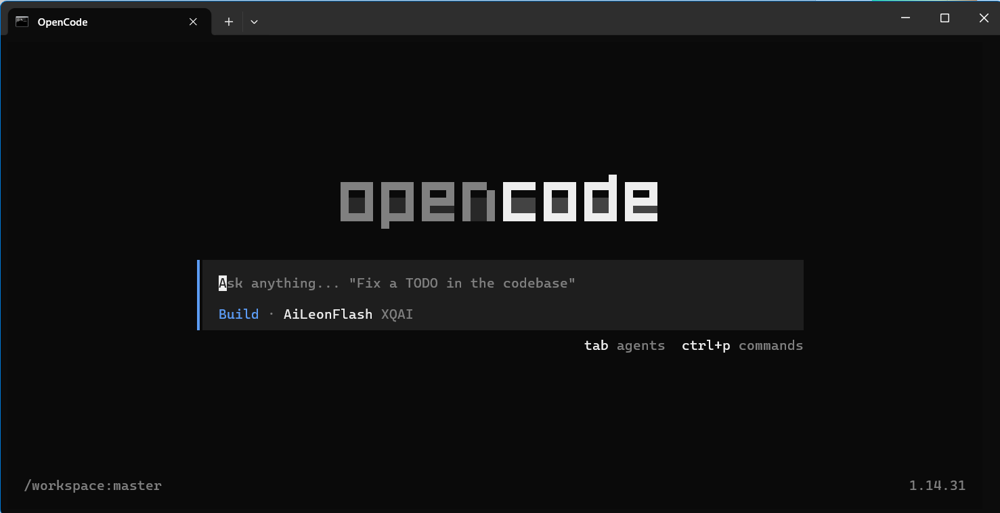
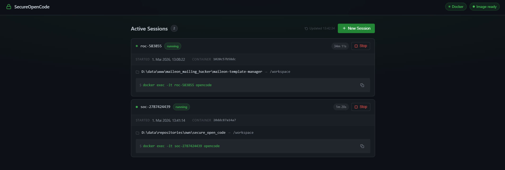
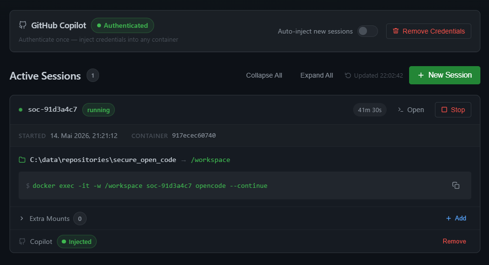
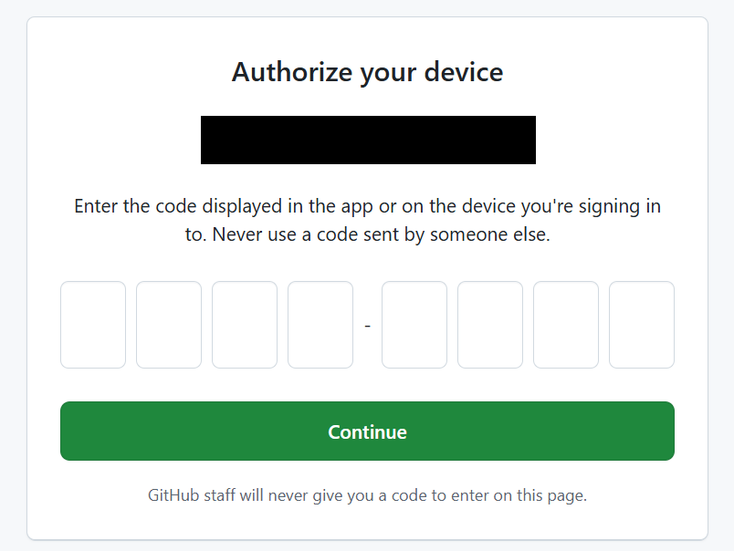
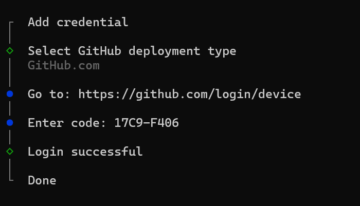
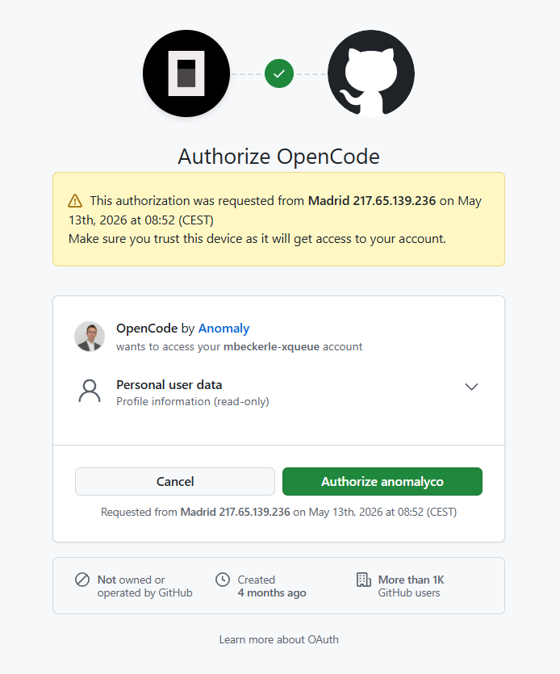
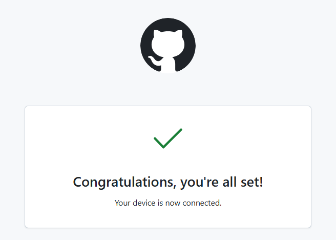
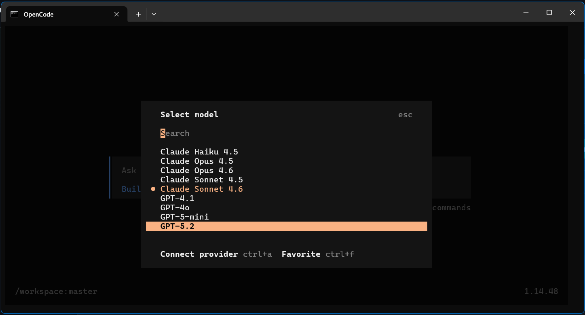

# SecureOpenCode

Runs [OpenCode](https://opencode.ai) inside a Docker container pre-configured with the XQAI provider. Any local project directory is bind-mounted into the container at `/workspace`. A Flask management server provides a dark-themed web UI for monitoring and managing sessions.

---

## Overview



```
soc [path]
  │
  ├─ Ensures Flask management server is running (auto-starts it)
  ├─ Builds the Docker image on first run
  ├─ Mounts [path] → /workspace inside a new container
  ├─ Opens http://localhost:5000 in the browser
  └─ Attaches to OpenCode interactively (docker exec -it)
```

Containers stay alive after OpenCode exits so you can reconnect or inspect them from the web UI. Each container is tracked via Docker labels (`opencode.managed=true`, `opencode.host_path=<path>`). Running `soc` on a directory that already has a running container reuses it instead of creating a new one.

---

## Prerequisites

| Requirement | Notes |
|---|---|
| **Docker Desktop** | https://docker.com — must be running |
| **Python 3.8+** | Windows: 3.10+ recommended, resolved via `py` launcher |
| **Admin rights** | Not required — user-level PATH only |

---

## Installation

### Windows (CMD)

```cmd
install.cmd
```

Open a new terminal window after installation completes.

### Unix / Git Bash / macOS

```bash
bash install.sh
```

Open a new shell (or `source ~/.bashrc`) after installation completes.

### What the installer does

1. Adds the project directory to the **user** PATH (Windows registry `HKCU`, no admin required) or creates `~/.local/bin/soc` symlink (Unix).
2. Creates a Python virtual environment at `.venv/`.
3. Installs `Flask==3.0.3` and `docker==7.1.0` into the venv.
4. Builds the `secure-opencode` Docker image (first time, ~1 minute).

---

## Usage

### `soc` — run OpenCode on a directory

```bash
soc                       # mounts the current directory
soc /path/to/project      # mounts the specified directory
soc C:\path\to\project    # Windows
```

**Workflow:**

1. `soc` auto-starts the Flask management server if it is not already running.
2. On first run, it builds the Docker image.
3. A container named `soc-<dirname>-<suffix>` is started with the directory bind-mounted at `/workspace`.
4. The browser opens at `http://localhost:5000`.
5. OpenCode launches interactively in the container working directory.
6. Typing `exit` in OpenCode detaches but leaves the container running.
7. Running `soc` again on the same directory reattaches to the existing container.

### Reconnect to an existing session

```bash
docker exec -it -w /workspace <container-name> opencode --continue
```

The connect command is shown on every session card in the web UI with a copy button. The `--continue` flag resumes the last active session — conversation history and context are preserved.

### Stop a session

Either click **Stop** in the web UI, or:

```bash
docker stop <container-name> && docker rm <container-name>
```

---

## Management Web UI

Start the server standalone (without launching OpenCode):

```cmd
start-server.cmd          # Windows
bash start-server.sh      # Unix / Git Bash
```

Then open **http://localhost:5000**.

### UI features

| Feature | Details |
|---|---|
| **Docker / Image status** | Navbar badges — live connection and image state |
| **Active Sessions** | Card per running container, auto-refreshes every 5 seconds |
| **Session card** | Container name, status, live uptime, started datetime, container ID, mount path, connect command with copy button |
| **New Session** | Create a session by entering an absolute directory path |
| **Stop / Remove** | Stop a running container or permanently remove a stopped one |
| **Build Image** | Shown when the `secure-opencode` image is missing; triggers a build |
| **Global Mappings** | Bind-mount additional host directories into every container — changes recreate all containers automatically |
| **Per-session Mappings** | Extra bind mounts scoped to a single container, shown in the collapsible *Extra Mounts* section of each session card |
| **Folder Browser** | Native server-side directory picker for selecting host paths — remembers the last visited directory across sessions, walks up to the nearest valid ancestor if a stored path no longer exists |
| **Session continuity** | OpenCode conversation history and context survive container recreations (mapping changes); each new terminal window resumes the last session via `--continue` |

The session list uses DOM diffing — cards update in-place without flickering. Uptime ticks every 10 seconds independently of the 5-second data refresh.



---

## Project Structure

```
SecureOpenCode/
├── docker/
│   ├── Dockerfile          # Ubuntu 24.04 + OpenCode
│   └── opencode.jsonc      # OpenCode provider configuration
├── templates/
│   └── index.html          # Flask template — dark SPA
├── app.py                  # Flask management server
├── requirements.txt        # Flask==3.0.3, docker==7.1.0
├── soc.cmd                 # Windows CLI entry point
├── soc.sh                  # Unix / Git Bash CLI entry point
├── start-server.cmd        # Start management server only (Windows)
├── start-server.sh         # Start management server only (Unix)
├── install.cmd             # Windows installer
└── install.sh              # Unix installer
```

---

## Docker Image

**Base image:** `ubuntu:24.04`

**Installed:**
- `curl`, `git`, `ca-certificates`, `nodejs`, `npm`
- OpenCode via `curl -fsSL https://opencode.ai/install | bash` (installs to `/root/.opencode/bin/`)

**Configuration:** `/root/.config/opencode/opencode.jsonc`

```jsonc
{
  "$schema": "https://opencode.ai/config.json",
  "enabled_providers": ["xqai", "github-copilot"],
  "disabled_providers": ["opencode"],
  "provider": {
    "xqai": {
      "name": "XQAI",
      "npm": "@ai-sdk/openai-compatible",
      "models": {
        "AiLeonFlash": { "name": "AiLeonFlash" },
        "AiLeon":      { "name": "AiLeon" }
      },
      "options": { "baseURL": "http://xq-ai.xqueue.int:11434/v1" }
    }
  }
}
```

The config is applied at container startup via `entrypoint.sh`, which copies `opencode.jsonc` from the mounted workspace into `/root/.config/opencode/`. No image rebuild is needed for config changes — recreate or restart the container to pick them up.

To rebuild the image after changing `Dockerfile`:

```bash
docker build -t secure-opencode docker/
```

Or use the **Build Image** button in the web UI.

---

## GitHub Copilot Authentication

GitHub Copilot is a built-in provider — no npm package installation required. Authentication is a one-time OAuth device flow. The token is stored server-side and can be injected into any container automatically.

### Via the Web UI (v1.2.0+)

Since v1.2.0, authentication can be managed entirely from the management UI — no manual `docker exec` required.



**1.** Open the **GitHub Copilot** panel in the web UI and click **Authenticate**. A terminal window opens and runs the auth flow inside a temporary container.

**2.** Select **GitHub.com (Public)** when prompted. The terminal shows a device code and a URL.

**3.** Open the URL, enter the device code shown in the terminal, and authorize OpenCode:



**4.** Once the terminal shows success, click **Capture Credentials** in the web UI. The credentials are stored and the terminal container is cleaned up.

**5.** Enable **Auto-inject** in the Copilot panel to have credentials injected into every new container automatically. For existing containers, use the **Inject** / **Remove** buttons on each session card.

---

### Via docker exec (manual)

You can also authenticate directly inside any running container (requires an interactive TTY — run in cmd/PowerShell, not via a script):

```cmd
docker exec -it <container-name> opencode auth login -p github-copilot -m "Login with GitHub Copilot"
```

Select **GitHub.com (Public)** when prompted. The CLI outputs a device code and a URL.


**Open the URL in a browser and authorize OpenCode:**



**Confirm authorization — the CLI polls automatically:**



The token is stored in the container's state volume (`<container>-state` → `/root/.local/share/opencode/auth.json`) and survives container recreations for that container only.

---

**GitHub Copilot models are now available in OpenCode — use `/models` to open the model selector:**



### Re-authentication

If the token expires, repeat the UI flow above or run the manual docker exec command again. To check current credentials:

```cmd
docker exec <container-name> opencode auth list
```

---

## Flask API

The management server runs on port `5000` by default (override with `PORT` env var).

| Method | Path | Description |
|---|---|---|
| `GET` | `/` | Web UI |
| `GET` | `/api/version` | Current version and full changelog |
| `GET` | `/api/status` | Docker connectivity and image state |
| `POST` | `/api/image/build` | Build the `secure-opencode` image |
| `GET` | `/api/browse?path=` | List subdirectories at a host path (drive list if empty) |
| `GET` | `/api/sessions` | List all managed containers |
| `POST` | `/api/sessions` | Create a new session — body: `{"path": "/abs/path"}` |
| `POST` | `/api/sessions/<id>/start` | Start a stopped container |
| `POST` | `/api/sessions/<id>/stop` | Stop a running container |
| `POST` | `/api/sessions/<id>/open` | Launch OpenCode in a new terminal window |
| `DELETE` | `/api/sessions/<id>` | Remove a session and its state volume |
| `GET` | `/api/sessions/<id>/mappings` | List per-session extra mounts |
| `POST` | `/api/sessions/<id>/mappings` | Add a per-session mount — body: `{"host_path": "...", "container_path": "..."}` |
| `PUT` | `/api/sessions/<id>/mappings/<mid>` | Update a per-session mount |
| `DELETE` | `/api/sessions/<id>/mappings/<mid>` | Remove a per-session mount |
| `GET` | `/api/mappings` | List global mappings |
| `POST` | `/api/mappings` | Add a global mapping — body: `{"host_path": "...", "container_path": "..."}` |
| `PUT` | `/api/mappings/<mid>` | Update a global mapping |
| `DELETE` | `/api/mappings/<mid>` | Remove a global mapping |

Sessions are identified by the Docker label `opencode.managed=true`. The `opencode.host_path` label stores the host directory path for container reuse detection. Each session gets a named Docker volume `<name>-state` mounted at `/root/.local/share/opencode` to persist OpenCode session data across container recreations.

---

## Changelog

The full changelog is also accessible inside the web UI — click the version badge in the bottom-right corner.

### v1.2.0 — 2026-05-14
- GitHub Copilot UI authentication — authenticate once from the web UI, credentials stored server-side
- Auto-inject setting — new containers automatically receive stored Copilot credentials
- Per-session Copilot inject / remove controls on every session card
- Version badge (bottom right of web UI) with clickable changelog popup

### v1.1.0 — 2026-04-01
- GitHub Copilot provider enabled in `opencode.jsonc`
- GitHub Copilot authentication guide (manual `docker exec` flow)

### v1.0.0 — 2026-03-01
- Initial stable release
- Session persistence via named Docker volumes
- Global and per-session bind-mount mappings
- Folder browser with last-path memory
- DOM-diffing session list (no card flicker)
- Windows CRLF fix and `-ExecutionPolicy Bypass` for fresh Windows 11 machines

---

## Troubleshooting

**`soc` not found after install**
Open a new terminal window. On Unix, run `source ~/.bashrc` or equivalent. Verify with `which soc` (Unix) or `where soc` (Windows).

**Docker image build fails**
Requires internet access during build to download OpenCode. Check Docker Desktop is running. Retry via the web UI **Build Image** button.

**OpenCode does not see the project files**
The container must be started with the directory bind-mounted at `/workspace`. Always use `docker exec -it -w /workspace <name> opencode --continue` (the `-w /workspace` flag sets the working directory; `--continue` resumes the last session).

**OpenCode starts a blank session after a mapping change**
Mapping changes recreate the container but preserve the OpenCode state volume. If you see a blank session, the container was created before session persistence was introduced — remove it via the web UI and create a new one.

**Duplicate containers after a mapping change on Windows**
On Windows, Docker's named pipe (error 109 / `GetOverlappedResult`) can drop mid-operation. The server retries with pipe-recovery logic and pre-cleans orphaned temp containers before each recreation. If duplicates appear, remove the extra container manually via `docker rm -f <name>`.

**Port 5000 already in use**
```bash
PORT=5001 python app.py          # Unix
set PORT=5001 && python app.py   # Windows CMD
```

**Python venv creation fails on Windows**
The installer kills any running `python.exe` psocesses before creating the venv. If it still fails, manually delete `.venv\` and re-run `install.cmd`.

**Inkscape Python 3.9 selected instead of Python 3.13**
The installer uses the `py -3` launcher to resolve Python, which skips non-dev interpreters. If you see version 3.9, ensure the Windows `py` launcher is installed with your Python 3.13 distribution.
